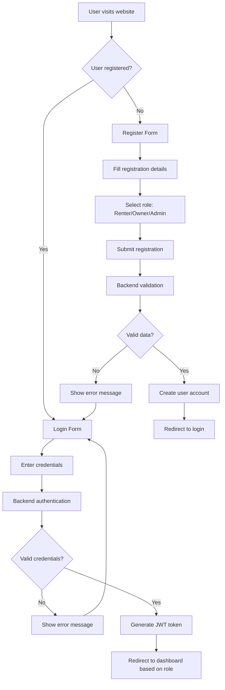
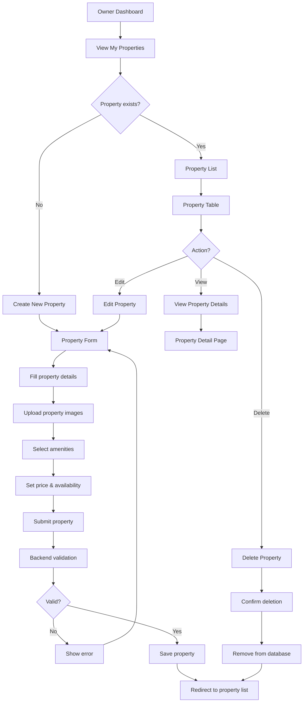
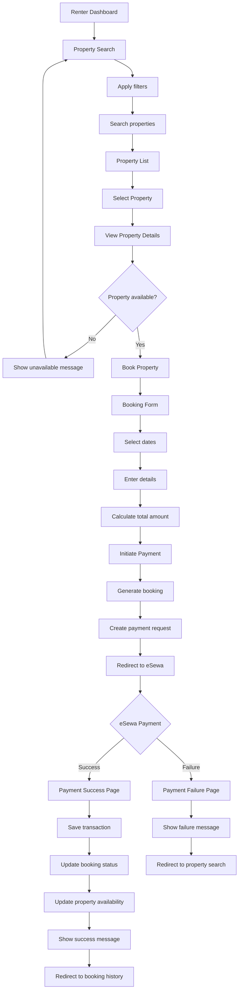
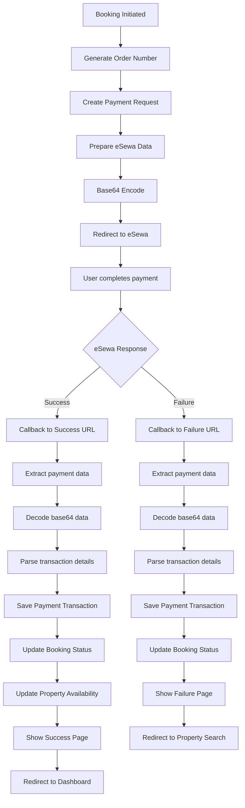
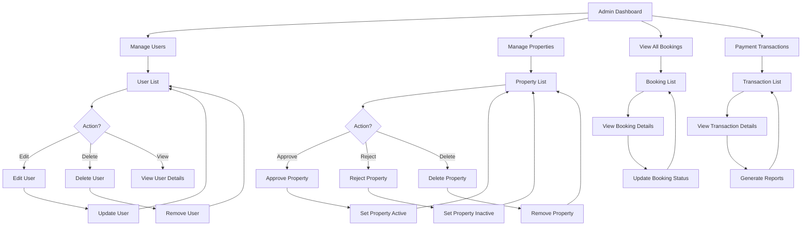
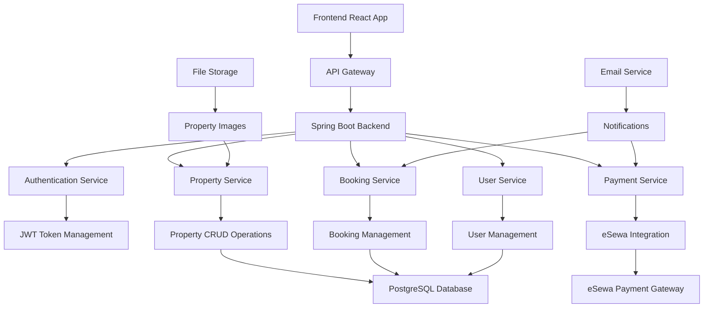
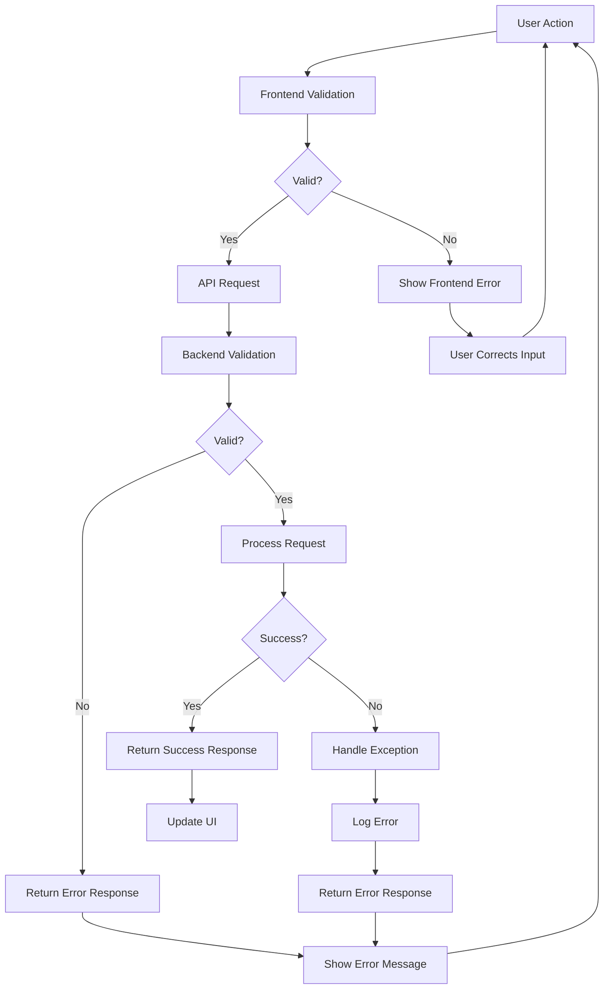
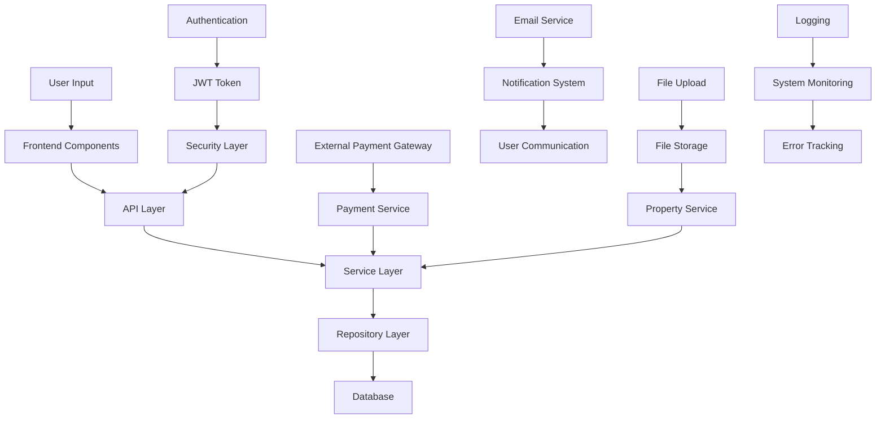

# Room Rental Portal - System Flowchart

## 1. User Registration & Authentication Flow

## 2. Property Management Flow (Owner)

## 3. Property Search & Booking Flow (Renter)

## 4. Payment Processing Flow

## 5. Admin Management Flow

## 6. Overall System Architecture Flow

## 7. Error Handling Flow

## 8. Data Flow Diagram

This flowchart documentation provides a comprehensive overview of the Room Rental Portal system's various flows, from user registration to payment processing, and includes error handling and system architecture diagrams. 